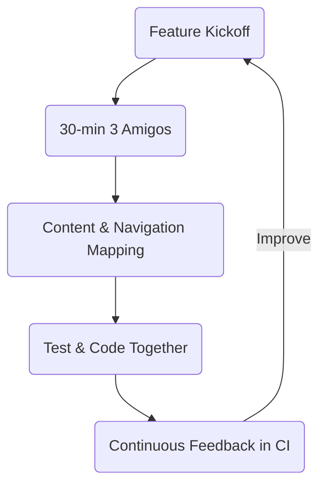

# Testing Strategy 2.0 – Continuous Quality for a Content-First, Navigation-Rich App

---

## Executive Summary
Our website is the digital front door to mVara. Every tap, swipe and scroll reflects directly on our brand. Yet traditional, phase-gated testing slows delivery, hides quality issues until late in the cycle and frustrates both engineers and stakeholders.  
**Testing Strategy 2.0** replaces hand-offs with a *Continuous Quality* model that embeds testing in the flow of work, protects our unique 5-tab + hidden-screen navigation, and empowers cross-functional teams to ship faster with higher confidence.  

*Business Impact for Leadership*
- **30 → 15 min** average commit-to-green-CI time on pilot flow (target Q2).  
- **50 % drop** in navigation/content regressions by introducing a single data-driven test harness.  
- **Happier teams:** survey confidence score ≥ 8/10 after first sprint.  

Investment is minimal—mostly coaching time and a small increase in automated-test minutes on CI—and delivers compounding returns through faster releases and fewer production fixes.

---

## 1 The Core Challenge
- Serial hand-offs (Dev → QA → UAT) create wait states.  
- Knowledge silos hide assumptions about content relationships across tabs.  
- Hidden screens receive ad-hoc, manual checks and become regression hotspots.  
- Changing content can unexpectedly break navigation contracts.

## 2 Vision: Continuous Quality


## 3 Key Practices (Tailored to Our App)

### 3.1 Content-First 3 Amigos (Dev ＋ QA ＋ PO)
| Minute | Activity | Remote-Friendly Tip |
|--------|----------|---------------------|
| 0-5 | Async prep: each amigo posts *Given/When/Then* examples in Jira/FigJam. | Use template cards. |
| 5-10 | Align on **User Impact** & success metric. | Screen-share story only. |
| 10-25 | Rapid Example Mapping (cluster, pick 2 golden paths ＋ 1 edge). | Timer-driven, colour-code by role. |
| 25-30 | Lock **Definition of Done** & pick next test slice. | Log in story, record call. |

### 3.2 Navigation-Aware, Data-Driven Tests
```typescript
// jest + react-native-testing-library
const fixtures = [
  { tab: 'Home',                heading: 'Welcome to mVara' },
  { tab: 'Wins',                heading: 'Strategic Wins'   },
  { tab: 'Edge',                heading: 'Competitive Edge' },
  { tab: 'Blueprint',           heading: 'Implementation'   },
  { tab: 'Insights',            heading: 'About mVara'      }
];

describe.each(fixtures)('%s tab', ({ tab, heading }) => {
  it('renders correct hero heading and retains state when switched', async () => {
    await openTab(tab);
    expect(screen.getByRole('heading', { name: heading })).toBeVisible();
    await openTab('Home');
    await openTab(tab);
    expect(screen.getByRole('heading', { name: heading })).toBeVisible();
  });
});
```
*One body, five data rows—zero duplication.*

### 3.3 Hidden Screen Contract Tests
```typescript
describe('Hidden screens', () => {
  const hidden = ['SalesIntelligence', 'WindsurfPartnership'];
  it.each(hidden)('%s is reachable and has back nav', async screenName => {
    await openHiddenScreen(screenName);
    expect(await screen.findByTestId(`${screenName}-root`)).toBeVisible();
    fireEvent.press(screen.getByLabelText('Back'));
    expect(screen.queryByTestId(`${screenName}-root`)).toBeNull();
  });
});
```

### 3.4 Navigation Contract Guard
A unit test that imports the central `TAB_NAMES` map and asserts every route key is registered in the navigator—catches typos at compile time.

### 3.5 Living Documentation
Tests double as executable specs; storybook snapshots provide visual diffing on content changes.

## 4 Implementation Roadmap (Team-of-Teams)
| Week | Stream | Deliverable | Success Signal |
|------|--------|-------------|----------------|
| 1 | Pilot (Home→Edge) | Data-driven harness + 1 flow test green in CI | CI time <15 min |
| 2 | Pilot | Hidden-screen param test added | 0 regressions on QA build |
| 3 | Rollout Team B | 3 Amigos coaching, pick their first flow | First test PR merged |
| 4 | All Teams | Dashboards for Metrics (see §5) | Leadership review |

## 5 Metrics & ROI
1. **Commit-to-Green-CI Time** (target <15 min).  
2. **Escaped Defects per Sprint** (should trend ↘).  
3. **Team Confidence Survey** (Slack emoji scale; target ≥8/10).  
4. **Navigation Regression Rate** (snapshot diff count).  

## 6 Team Collaboration & Governance
- **Guild Lead (QE Architect)** curates harness, reviews navigation tests.  
- **Feature Teams** own their fixtures & scenarios.  
- **Weekly Guild Sync** surfaces cross-team learnings, updates shared helpers.  
- **Leadership Check-in (bi-weekly)** reviews metric dashboard; unblocks resources.

## 7 Risks & Mitigations
| Risk | Mitigation |
|------|------------|
| Engineers perceive tests as extra work | Pair programming + showing reduced rework time. |
| Snapshot flakes | Lock test data seeds, run CI in deterministic mode. |
| Hidden screens still overlooked | Contract test fails build if list changes. |

## 8 Conclusion & Next Steps
Our content-first product demands a content-first quality strategy. Testing Strategy 2.0 unifies development and QA into a single flow, cuts cycle time, and safeguards the brand experience across our sophisticated navigation scheme.  
**Immediate actions for leadership:**
1. Endorse the **2-week pilot** and allow 10 % allocation for 3 Amigos + harness work.  
2. Approve minor CI budget increase (~$40/mo) for additional test minutes.  
3. Nominate a **QE Guild Lead** to steward cross-team consistency.  

With your support, teams will deliver visible quality improvements within the next sprint—and set the foundation for faster, safer releases every quarter thereafter.
